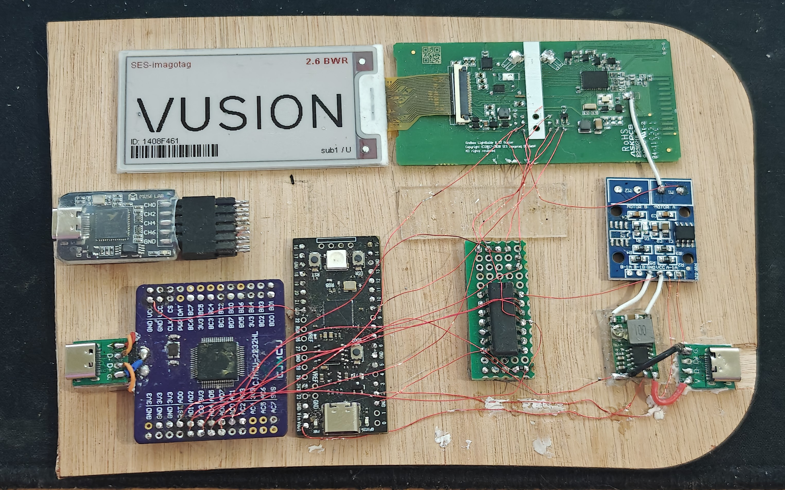
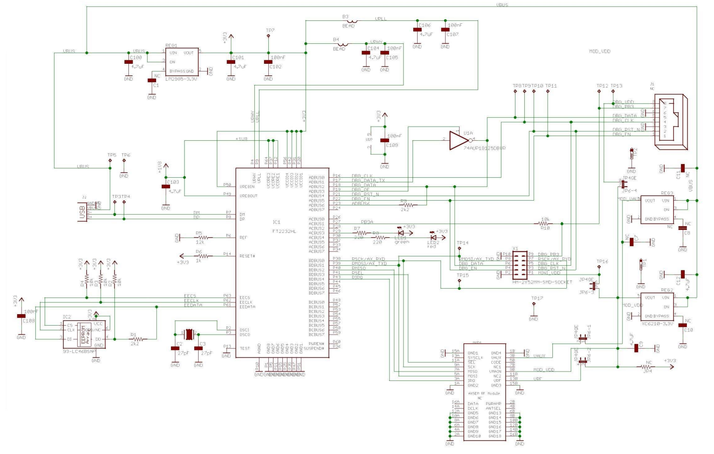

This journey began when i read some blog posts by Dmitry Grinberg and Aaron Christopher detailing their experiences with reverse engineering electronic shelf tags with E-Ink displays. 
It took me about 6.5 minutes before i had ordered a couple of Solum ST-GR29000 ESL tags from ebay. These tags cost me around €9 each. This wasn't a bad price at all and i was excited to get started.
After installing OpenEPaperLink on these tags i was happy with the results. I instantly foresaw myself using these on each and every box of parts in my office. However this would be quite expensive.
So, having zero impulse control or apparently no ability to do the quick math that would have told me that this would be a bad idea, i ordered 80 more tags, this time, substantially cheaper tags. 

The only difference between the two tags was that the cheaper tags had a different microcontroller on board. The main caveat is that Aaron Christopher, the maker of the OpenEPaperLink firmware, just 
so happens to be working for SES-imagotag, the company that makes the cheaper tags and has no intention of making them compatible. Ever. It seems he and i disagree wether an open source firmware 
would benefit or harm a company. I think it would benefit them, but nonetheless, i respect his decision. However this leaves me having to reinvent the wheel and make my own firmware.

With 5 years of experience in Research & Development of embedded systems, this sounds like a fun challenge that will definitely not take up all of my free time for the foreseeable future.

## The plan
The overall plan should have been:

1. Reverse engineer the layout and connections of the PCB
2. Find the appropiate datasheets and toolchain to write my own firmware
3. Write my own firmware

Writing this post halfway through the process, i definitely wasn't as straight forward as i had hoped. The latest revision of the plan is as follows:

1. Reverse engineer the layout and connections of the PCB
2. Find the appropiate datasheets and toolchain to write my own firmware
3. Realize that the MCU on board is EOL, documentation is scarce, debugging hardware is non-standard and hard to acquire and the toolchain is not what i had hoped
4. Fix up the toolchain
5. Get a basic serial bootloader working where i had to write my own flashing tool just to Development
6. Only now 'start' writing my own firmware (which is where i am at as of writing this post)

Since this series of posts will go over the process chronologically, the full plan and status isn't too relevant and is documented in the other sections of this website. Feel free to look around for a more complete
'plan' and status of the project. Back to the topic at hand.

## First observations
The tags i received are SES-ImagoTag VUSION 2.6 BWR UU340 tags. These are wireless ESL tags with 868MHz radio, a 2.6" E-Ink display and two LED's in the front. 

(INSERT PICTURE OF TAG)

## Components
To find the components and do preliminary tracing i just take my trusty Zeiss Opmi-1 microscope and start looking around. This is a great way to find the components and get a feel for the layout of the PCB.
This resulted in the following list of components:

| Part | Function | Description | Link |
|------|----------|-------------|------|
| AX8052F143 | MCU | 8-bit 8051 MCU with integrated radio | [Datasheet](./assets/axsem-ax8052-datasheet.pdf) |
| FM11NT081DS | NFC | NFC Forum Type 2 Tag IC | [Datasheet](./assets/FM11NT0X1D.pdf) |
| GDEW026Z39 | Display | 2.6" E-ink display module |[Datasheet](./assets/GDEW0213Z16.pdf) |
| T.B.D | Flash | 1Mb Serial Flash Memory | - |

I am quite sure the last component on the list is a flash memory, but i haven't been able to reference the markings to any specific part yet. However when looking at similar products, the logical choice would be a 1Mb serial flash memory that shares the SPI bus with the E-Ink display. Later testing will probably confirm this. Finding the NFC chip was actually quite tricky, since the markings of the chip mostly lead to a 4-pin NFC chip that is completely different. It just so happens that i'm pretty good at chinesium.

> **chi·ne·si·um** /ˌčʌɪˈniziəm/ *n.* informal, humorous
> 
> 1. The cryptic yet technically accurate language commonly found in product descriptions, instruction manuals, and specifications from Chinese manufacturers, characterized by:
>    a. Specifications that require contextual interpretation
>    b. Technical values that exist within a flexible range of possibility
>    c. Product features described through carefully worded, albeit ambiguous phrasing
> 
> *Example:* "According to the chinesium in this datasheet, the LED driver is 'compatible with standard voltages' and has a 'recommended operating current of about 350mA ±20% typical.'"
> 
> *Origin:* 2010s, blend of "Chinese" + "-ium" (linguistic suffix), popularized in online commerce communities
> 
> *Related:* chinesium interpretation (n.): the art of accurately determining a product's actual specifications from deliberately flexible descriptions

back on topic, it turned out that the exact part numbering referred to a completely different product, but the FM11NT0X1D where the X had to be replaced with the value on the part was the correct part (same manufacturer, completely different product and product range, go figure).

## Finding connections
To find the connections of the PCB i followed my usual method of taking pictures and tracing the signals out on my ipad. This might not be the best or most efficient way, but i like it and it works for me.

## Testing setup
To hack and reverse engineer hardware i prefer to make a setup somewhere in between permanent and temporary. Usually I just 3D print some standoffs and lay everything out on a piece of wood.
This allows me to tweak, experiment and poke around while still having a stable setup.

I did add a mosfet board in between the power supply and the ESL tag to possibly start doing some glitching attacks. However i didn't get to that yet, i might do that at some later stage.

## Programmer
Some searching lead to the discovery that the propietary programmer from Axsem is just an FT2232H with a tri-state buffer. This meant that i could rig up my own programmer with parts laying around.

